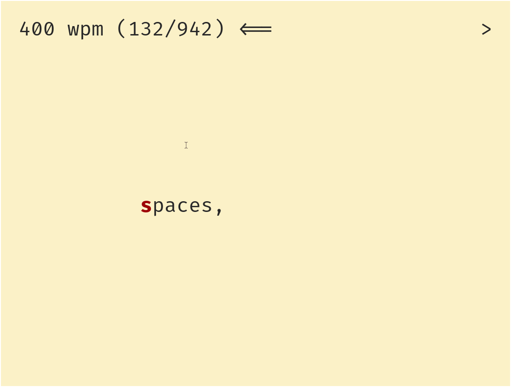

# greedy - a simple speedreader for your terminal

`go get -u -v github.com/skuzzymiglet/greedy`

```sh
echo "hello stdin" | greedy # read from stdin
greedy https://www.arp242.net/read-stdin.html # read articles from the web
```



# keys

+ `q`: quit
+ space: pause
+ `]`: speed up
+ `[`: slow down
+ `h`: move back a word
+ `l`: move forward a word
+ `<`: move text left
+ `>`: move text right

[](https://asciinema.org/a/dE2t5QYhS8cCbHhmVd1c4qDrY)
